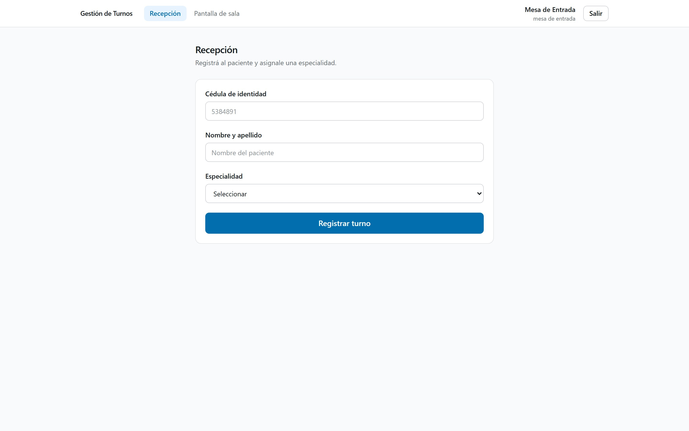
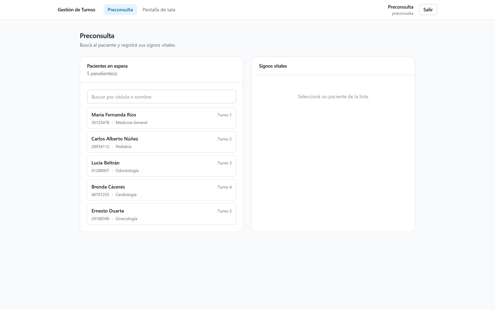
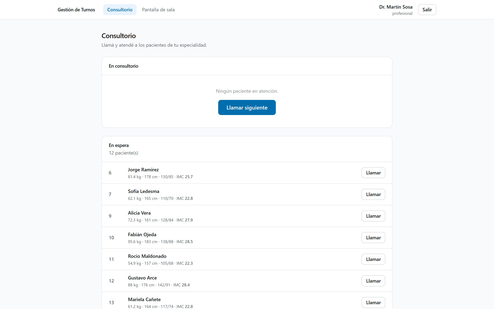
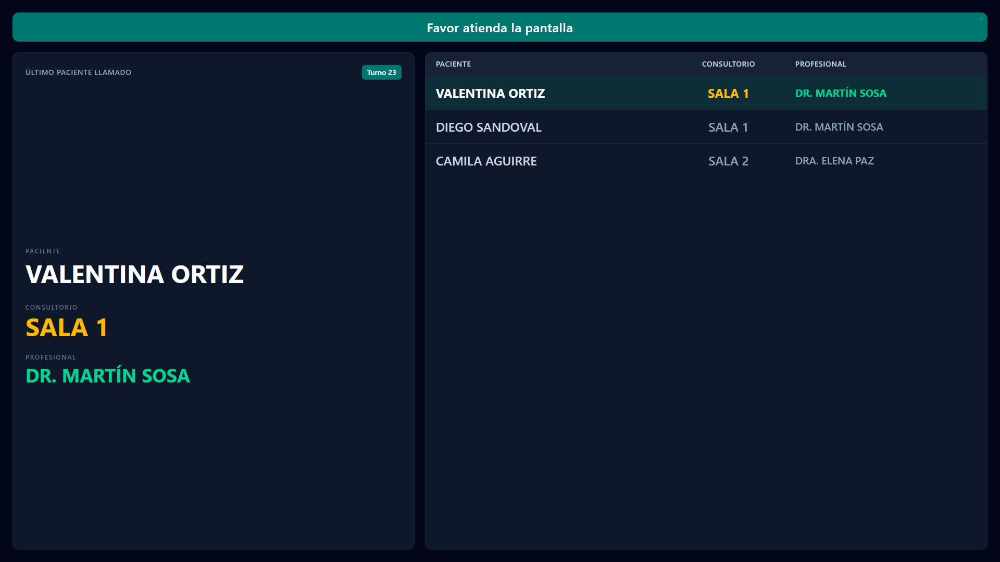
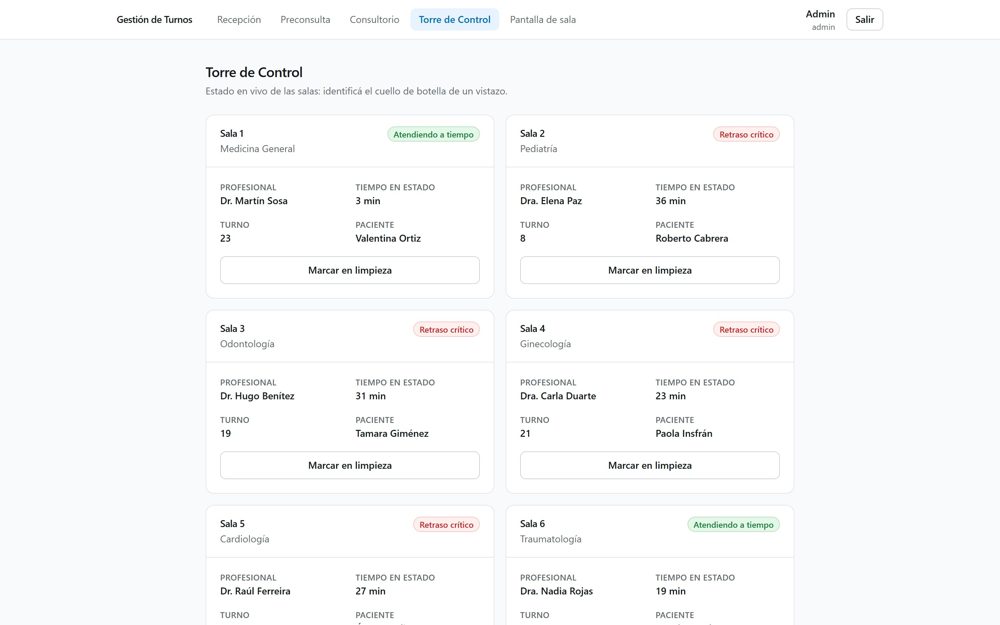
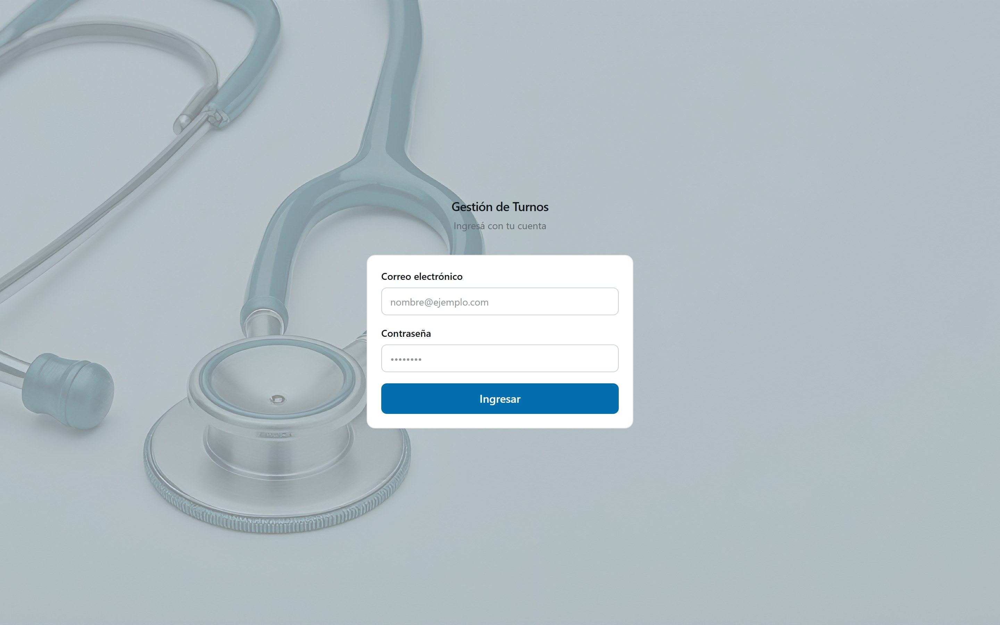
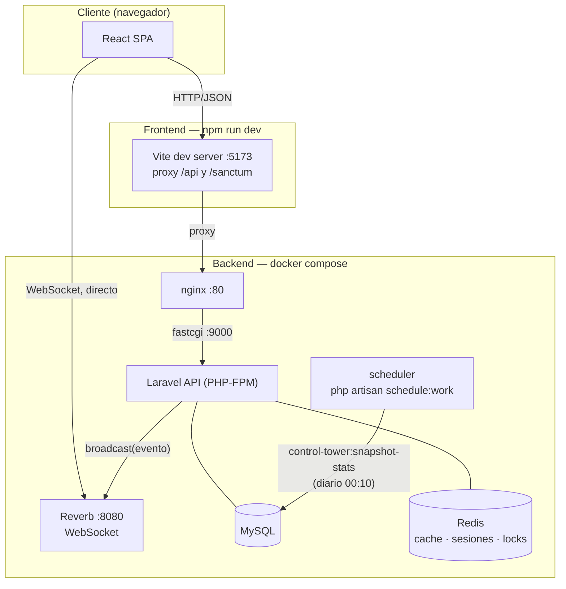

# Sistema de Gestión de Turnos

Gestión de turnos para un centro de salud: registro de pacientes, preconsulta,
llamado desde el consultorio y anuncio en la pantalla de la sala de espera, con
actualización en tiempo real y aviso por voz.

## Capturas

<table>
<tr>
<td width="50%">

**Recepción** — registra al paciente y emite el turno.

</td>
<td width="50%">

**Preconsulta** — busca al paciente y carga sus signos vitales.

</td>
</tr>
<tr>
<td width="50%">

**Consultorio** — cola del profesional y llamado al paciente.

</td>
<td width="50%">

**Pantalla de sala** — se actualiza sola por WebSocket y anuncia por voz.

</td>
</tr>
<tr>
<td width="50%">

**Torre de Control** (admin) — estado en vivo de las 6 salas, cuello de botella de un vistazo.

</td>
<td width="50%">

**Ingreso** — sesión por cookie HttpOnly, sin tokens en el cliente.

</td>
</tr>
</table>

## Flujo

```
Recepción  ──▶  Preconsulta  ──▶  Consultorio  ──▶  Pantalla de sala
registrado   preconsulta_completa    llamado      atendido / ausente
```

1. **Recepción** registra al paciente (cédula, nombre) y elige la especialidad.
   El turno recibe un número correlativo que reinicia cada día.
2. **Preconsulta** busca al paciente, carga peso, altura y presión. El IMC se
   calcula solo y se muestra con su categoría.
3. **Consultorio** ve únicamente los pacientes de su especialidad y los llama.
4. **Pantalla de sala** anuncia el llamado por voz y lo muestra en pantalla.

Cada pantalla se actualiza sola por WebSocket: no hay que recargar.

## Stack

| Capa | Tecnología |
|---|---|
| Backend | Laravel 13 · PHP 8.4 · Sanctum · Spatie Permission |
| Base de datos | MySQL 8 |
| Tiempo real | Laravel Reverb (WebSockets) · Redis |
| Frontend | React 19 · Vite 8 · Tailwind CSS 4 |
| Infraestructura | Docker Compose · nginx |
| Calidad | Pest · PHPStan (larastan) · Pint · ESLint |

## Arquitectura



El navegador habla con el backend por dos canales separados: peticiones HTTP normales
(vía el proxy de Vite en desarrollo, o directo a nginx en producción) y una conexión
WebSocket aparte contra Reverb, que es donde llegan los eventos en tiempo real
(`cola.actualizada`, `paciente.llamado`). nginx nunca ve el tráfico de WebSocket: el
navegador se conecta a Reverb directo por su propio puerto.

## Puesta en marcha

Requisitos: Docker Desktop y Node 20+.

```bash
# 1. Backend
cd gestion-turnos-back
cp .env.example .env
docker compose up -d
docker compose exec app php artisan key:generate
docker compose exec app php artisan migrate --seed

# 2. Frontend
cd ../gestion-turnos-front
npm install
npm run dev
```

Antes de levantar hay que completar en `gestion-turnos-back/.env`:
`DB_PASSWORD`, `MYSQL_ROOT_PASSWORD`, `REDIS_PASSWORD`, `REVERB_APP_KEY` y
`REVERB_APP_SECRET`.

- Aplicación: <http://localhost:5173>
- API: <http://localhost>
- Pantalla de sala: <http://localhost:5173/tv>

> Los comandos de Docker se corren **siempre desde `gestion-turnos-back/`**.
> Es el único proyecto de Compose: levantarlo desde otra carpeta crea
> contenedores duplicados con volúmenes distintos.

### Usuarios de ejemplo

Los crea el seeder con la contraseña de `SEED_PASSWORD` (por defecto
`password123`). **No se siembran en producción.**

| Email | Rol |
|---|---|
| `admin@example.com` | admin |
| `entrada@example.com` | mesa de entrada |
| `preconsulta@example.com` | preconsulta |
| `profesional@example.com` | profesional (Medicina General) |
| `pediatra@example.com` | profesional (Pediatría) |

Hay uno por especialidad: odontología, ginecología, cardiología y traumatología.

## Decisiones de diseño

**Identificadores.** La API usa ULID; el número que ve y escucha el paciente es
un correlativo diario. Separarlos evita que se puedan enumerar turnos ajenos
(`/turnos/1`, `/turnos/2`…) sin sacrificar un número corto y pronunciable.

**Datos cifrados con búsqueda.** La cédula y los datos clínicos se guardan
cifrados. Como el cifrado no es determinista y no admite `WHERE`, la cédula
suma un **índice ciego**: un HMAC que permite buscar sin poder revertirlo.

**Concurrencia.** Dos profesionales de la misma especialidad ven el mismo turno
libre y pueden llamarlo a la vez; dos recepcionistas pueden pedir el mismo
número correlativo. Ambos casos se protegen con `Cache::lock` más un índice
único en la base.

**Canal público mínimo.** La pantalla de sala es pública, así que su canal solo
transporta turno, paciente, sala y profesional. No viaja la especialidad
(permitiría inferir la condición médica del paciente) ni ningún dato clínico.

**Sesión por cookie.** La autenticación usa cookies `HttpOnly`, no tokens en
`localStorage`: un XSS no puede robar la sesión.

Detalle completo de las protecciones en [SEGURIDAD.md](SEGURIDAD.md).

## Verificación

```bash
cd gestion-turnos-back
docker compose exec app php artisan test
docker compose exec app ./vendor/bin/pint --test
docker compose exec app ./vendor/bin/phpstan analyse

cd ../gestion-turnos-front
npm run build
```

## Backups

```bash
cd gestion-turnos-back
bash docker/backup.sh          # dump comprimido, rotación a 30 días
```

> Los dumps contienen datos clínicos: guardalos cifrados y fuera del servidor.
> Con el cifrado en reposo activo, un backup **sin la `APP_KEY` es inservible**:
> hay que resguardar ambas cosas juntas.

## Antes de producción

- `APP_DEBUG=false` y `APP_ENV=production`
- HTTPS con certificado válido
- Rotar todos los secretos y borrar los usuarios de ejemplo
- Programar y **probar** la restauración del backup
