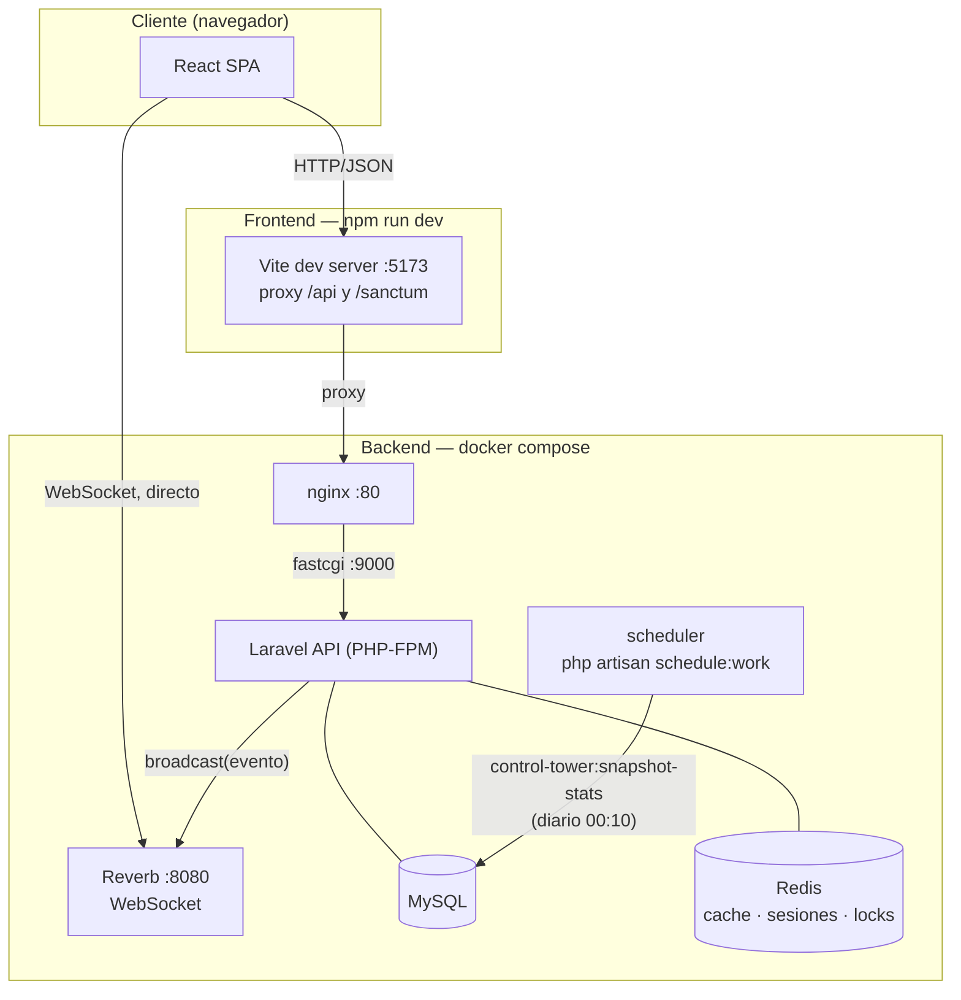

# Sistema de Gestión de Turnos

Gestión de turnos para un centro de salud: registro de pacientes, preconsulta,
llamado desde el consultorio y anuncio en la pantalla de la sala de espera, con
actualización en tiempo real y aviso por voz.

## Capturas

<table>
<tr>
<td width="50%">

**Mesa de entrada** — registra al paciente y emite el turno.

</td>
<td width="50%">

**Preconsulta** — busca al paciente y carga sus signos vitales.

</td>
</tr>
<tr>
<td width="50%">

**Consultorio** — cola del profesional y llamado al paciente.

</td>
<td width="50%">

**Pantalla de sala** — se actualiza sola por WebSocket y anuncia por voz.

</td>
</tr>
<tr>
<td width="50%">

**Torre de Control** (admin) — estado en vivo de las 6 salas, cuello de botella de un vistazo.

</td>
<td width="50%">

**Ingreso** — sesión por cookie HttpOnly, sin tokens en el cliente.

</td>
</tr>
</table>

## Flujo

```
Mesa de entrada ──▶ Preconsulta  ──▶  Consultorio  ──▶  Pantalla de sala
registrado   preconsulta_completa    llamado      atendido / ausente
```

1. **Mesa de entrada** registra al paciente (cédula, nombre) y elige la especialidad.
   El turno recibe un número correlativo que reinicia cada día.
2. **Preconsulta** busca al paciente, carga peso, altura y presión. El IMC se
   calcula solo y se muestra con su categoría.
3. **Consultorio** ve únicamente los pacientes de su especialidad y los llama.
4. **Pantalla de sala** anuncia el llamado por voz y lo muestra en pantalla.

Cada pantalla se actualiza sola por WebSocket: no hay que recargar.

## Stack

| Capa | Tecnología |
|---|---|
| Backend | Laravel 13 · PHP 8.4 · Sanctum · Spatie Permission |
| Base de datos | MySQL 8 |
| Tiempo real | Laravel Reverb (WebSockets) · Redis |
| Frontend | React 19 · Vite 8 · Tailwind CSS 4 |
| Infraestructura | Docker Compose · nginx |
| Calidad | Pest · PHPStan (larastan) · Pint · ESLint |

## Arquitectura



El navegador habla con el backend por dos canales separados: peticiones HTTP normales
(vía el proxy de Vite en desarrollo, o directo a nginx en producción) y una conexión
WebSocket aparte contra Reverb, que es donde llegan los eventos en tiempo real
(`cola.actualizada`, `paciente.llamado`). nginx nunca ve el tráfico de WebSocket: el
navegador se conecta a Reverb directo por su propio puerto.

**Reverb es solo el broadcaster local.** Mantener un proceso de WebSocket
propio corriendo 24/7 no entra en los planes gratuitos de la mayoría de los
hosts. Por eso el broadcaster es intercambiable por variable de entorno
(`BROADCAST_CONNECTION` en el backend, `VITE_BROADCASTER` en el frontend):
en local es Reverb (sin cuenta externa), y el deploy público usa
[Pusher Channels](https://pusher.com/channels/) (plan gratuito, sin proceso
propio que mantener). Los eventos (`ColaActualizada`, `PacienteLlamado`) no
cambian ni el canal ni el payload: solo cambia a qué servidor se conecta el
cliente.

## Puesta en marcha

Requisitos: Docker Desktop y Node 20+.

```bash
# 1. Backend
cd gestion-turnos-back
cp .env.example .env
docker compose up -d
docker compose exec app php artisan key:generate
docker compose exec app php artisan migrate --seed

# 2. Frontend
cd ../gestion-turnos-front
npm install
npm run dev
```

Antes de levantar hay que completar en `gestion-turnos-back/.env`:
`DB_PASSWORD`, `MYSQL_ROOT_PASSWORD`, `REDIS_PASSWORD`, `REVERB_APP_KEY` y
`REVERB_APP_SECRET`.

- Aplicación: <http://localhost:5173>
- API: <http://localhost>
- Pantalla de sala: <http://localhost:5173/tv>

> Los comandos de Docker se corren **siempre desde `gestion-turnos-back/`**.
> Es el único proyecto de Compose: levantarlo desde otra carpeta crea
> contenedores duplicados con volúmenes distintos.

### Usuarios de ejemplo

Los crea el seeder con la contraseña de `SEED_PASSWORD` (por defecto
`password123`). **No se siembran en producción.**

| Email | Rol |
|---|---|
| `admin@example.com` | admin |
| `entrada@example.com` | mesa de entrada |
| `preconsulta@example.com` | preconsulta |
| `profesional@example.com` | profesional (Medicina General) |
| `pediatra@example.com` | profesional (Pediatría) |

Hay uno por especialidad: odontología, ginecología, cardiología y traumatología.

## Demo pública (deploy gratis)

Para tener un link mostrable sin depender de que una máquina local esté
prendida, hay una imagen Docker aparte en la raíz del repo (`Dockerfile`,
`docker/render/`, `render.yaml`) pensada específicamente para un hosting
gratuito como [Render](https://render.com): sirve el build de React y la
API de Laravel desde el mismo origen (nginx + PHP-FPM en un solo
contenedor), con SQLite en vez de MySQL y sin Redis — menos piezas externas
que puedan romperse en un plan gratis. El único servicio de verdad externo
es [Pusher](https://pusher.com/channels/) para el tiempo real, porque
mantener un WebSocket propio (Reverb) corriendo 24/7 no entra en un plan
gratuito. Nada de esto toca el stack de desarrollo local, que sigue siendo
Docker Compose + MySQL + Redis + Reverb tal como está documentado arriba.

**Trade-offs, a propósito:**
- La base es efímera: el free tier de Render no tiene disco persistente,
  así que cada arranque (deploy nuevo, o el contenedor despertando tras
  dormirse por inactividad) corre `migrate` + `seed` de cero. Es una demo
  con datos falsos, no hace falta persistir nada entre visitas.
- Ese mismo free tier duerme el servicio a los 15 minutos sin tráfico: el
  primer click después de eso tarda ~30–60s en responder (cold start).
  Después de eso anda normal.
- `APP_ENV=demo`, no `production`: a propósito, porque `UserSeeder` se
  niega a correr en producción real (crearía cuentas de contraseña
  conocida). `APP_DEBUG=false` sigue activo de forma independiente.

### Desplegar

1. Crear una cuenta gratis en [Render](https://render.com) y conectarla a
   este repositorio de GitHub.
2. **New +** → **Blueprint** → elegir este repo. Render detecta
   `render.yaml` solo y arma el servicio.
3. Antes de que termine de desplegar (o inmediatamente después), completar
   en el dashboard del servicio → **Environment** las variables que
   `render.yaml` deja pendientes:
   - `APP_URL` y `FRONTEND_URL`: la URL completa que Render asignó, ej.
     `https://gestion-turnos-demo.onrender.com` (se ve en la parte de
     arriba del dashboard del servicio apenas se crea).
   - `SANCTUM_STATEFUL_DOMAINS` y `SESSION_DOMAIN`: el mismo dominio, sin
     `https://` (ej. `gestion-turnos-demo.onrender.com`).
   - `PUSHER_APP_ID`, `PUSHER_APP_KEY`, `PUSHER_APP_SECRET`,
     `PUSHER_APP_CLUSTER`: desde
     [dashboard.pusher.com](https://dashboard.pusher.com), la app de
     Channels que hayas creado → pestaña **App Keys**.
4. Redeploy (Render lo hace solo al guardar las variables). Login con
   cualquier [usuario de ejemplo](#usuarios-de-ejemplo).

## Decisiones de diseño

**Identificadores.** La API usa ULID; el número que ve y escucha el paciente es
un correlativo diario. Separarlos evita que se puedan enumerar turnos ajenos
(`/turnos/1`, `/turnos/2`…) sin sacrificar un número corto y pronunciable.

**Datos cifrados con búsqueda.** La cédula y los datos clínicos se guardan
cifrados. Como el cifrado no es determinista y no admite `WHERE`, la cédula
suma un **índice ciego**: un HMAC que permite buscar sin poder revertirlo.

**Concurrencia.** Dos profesionales de la misma especialidad ven el mismo turno
libre y pueden llamarlo a la vez; dos recepcionistas pueden pedir el mismo
número correlativo. Ambos casos se protegen con `Cache::lock` más un índice
único en la base.

**Canal público mínimo.** La pantalla de sala es pública, así que su canal solo
transporta turno, paciente, sala y profesional. No viaja la especialidad
(permitiría inferir la condición médica del paciente) ni ningún dato clínico.

**Sesión por cookie.** La autenticación usa cookies `HttpOnly`, no tokens en
`localStorage`: un XSS no puede robar la sesión.

Detalle completo de las protecciones en [SEGURIDAD.md](SEGURIDAD.md).

## Verificación

79 tests (Pest) sobre lo que realmente puede fallar en un sistema con datos de
salud, no sobre getters y setters:

- **Autorización cruzada** — un profesional de otra especialidad no ve ni
  puede tocar un turno ajeno; un colega no puede operar un turno que ya tomó
  otro; ninguna acción de escritura funciona sin el rol correcto
  (`impide que un profesional de otra especialidad vea el turno en su cola`,
  `rechaza alternar limpieza sin rol admin`).
- **Máquina de estados del turno** — no se puede atender ni marcar ausente un
  turno que no fue llamado, ni completar la misma preconsulta dos veces
  (`impide atender o marcar ausente un turno que no fue llamado`).
- **Exposición de datos** — el canal público y el endpoint de la TV nunca
  filtran cédula, especialidad ni datos clínicos; los turnos se identifican
  por ULID, nunca por el id autoincremental
  (`no expone datos sensibles en el evento de broadcast`,
  `no permite enumerar turnos por el id autoincremental`).
- **Cifrado en reposo** — cédula y datos clínicos viajan cifrados en la base
  (`cifra en la base los datos clínicos y la cédula`).
- **Sesión** — login por cookie sin token filtrable, logout real, intentos
  fallidos auditados y con freno de fuerza bruta
  (`no revela si el email existe al fallar el login`,
  `bloquea la fuerza bruta tras varios intentos fallidos`).
- **Torre de Control** — cada estado de sala (a tiempo, retraso crítico,
  limpieza, vacía por inasistencia) se prueba por separado, y la limpieza
  manual siempre gana sobre el estado calculado
  (`la limpieza tiene prioridad sobre cualquier otro estado calculado`).
- **Concurrencia e idempotencia** — el correlativo diario no se duplica ni se
  mezcla entre días, y recalcular las estadísticas de un día no crea filas
  repetidas (`no mezcla turnos de otro dia en el conteo`).
- **Integridad de los datos de identidad** — la cédula solo admite dígitos y el
  nombre solo letras, espacios, apóstrofos y guiones. No es cosmética: el
  índice ciego normaliza puntos y guiones, pero no las letras, así que
  `A1234567` abría una ficha nueva para el mismo paciente
  (`rechaza cédulas que no sean solo dígitos`,
  `acepta nombres con acentos, ñ, apóstrofos y guiones`).
- **Integridad de los signos vitales** — la presión arterial exige forma
  `sistólica/diastólica` y rangos fisiológicos, y rechaza la invertida. Antes
  era texto libre y `xx` entraba como medición
  (`rechaza valores con formato correcto pero fuera de lo posible`).

```bash
cd gestion-turnos-back
docker compose exec app php artisan test
docker compose exec app ./vendor/bin/pint --test
docker compose exec app ./vendor/bin/phpstan analyse

cd ../gestion-turnos-front
npm run build
```

## Backups

```bash
cd gestion-turnos-back
bash docker/backup.sh          # dump comprimido, rotación a 30 días
```

> Los dumps contienen datos clínicos: guardalos cifrados y fuera del servidor.
> Con el cifrado en reposo activo, un backup **sin la `APP_KEY` es inservible**:
> hay que resguardar ambas cosas juntas.

## Antes de producción

- `APP_DEBUG=false` y `APP_ENV=production`
- HTTPS con certificado válido
- Rotar todos los secretos y borrar los usuarios de ejemplo
- Programar y **probar** la restauración del backup
